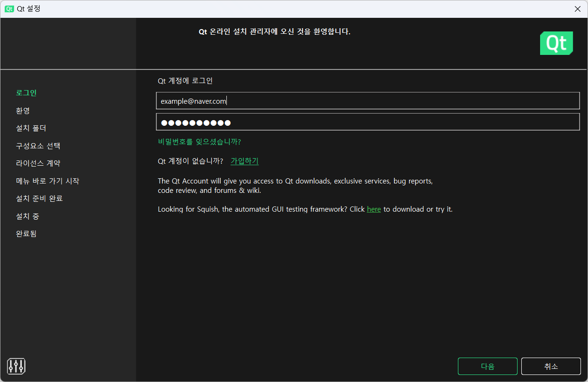
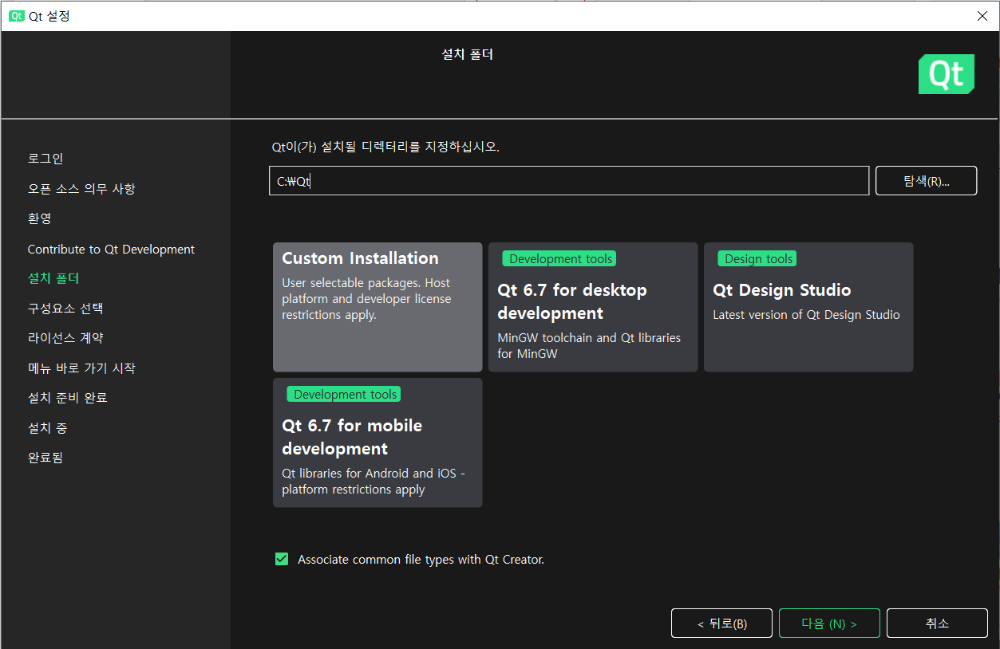
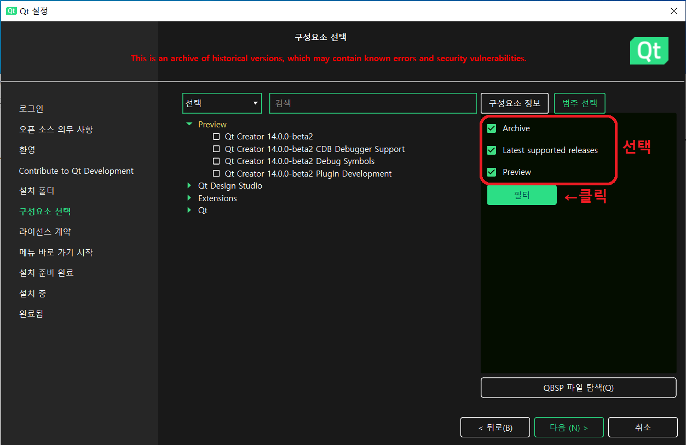
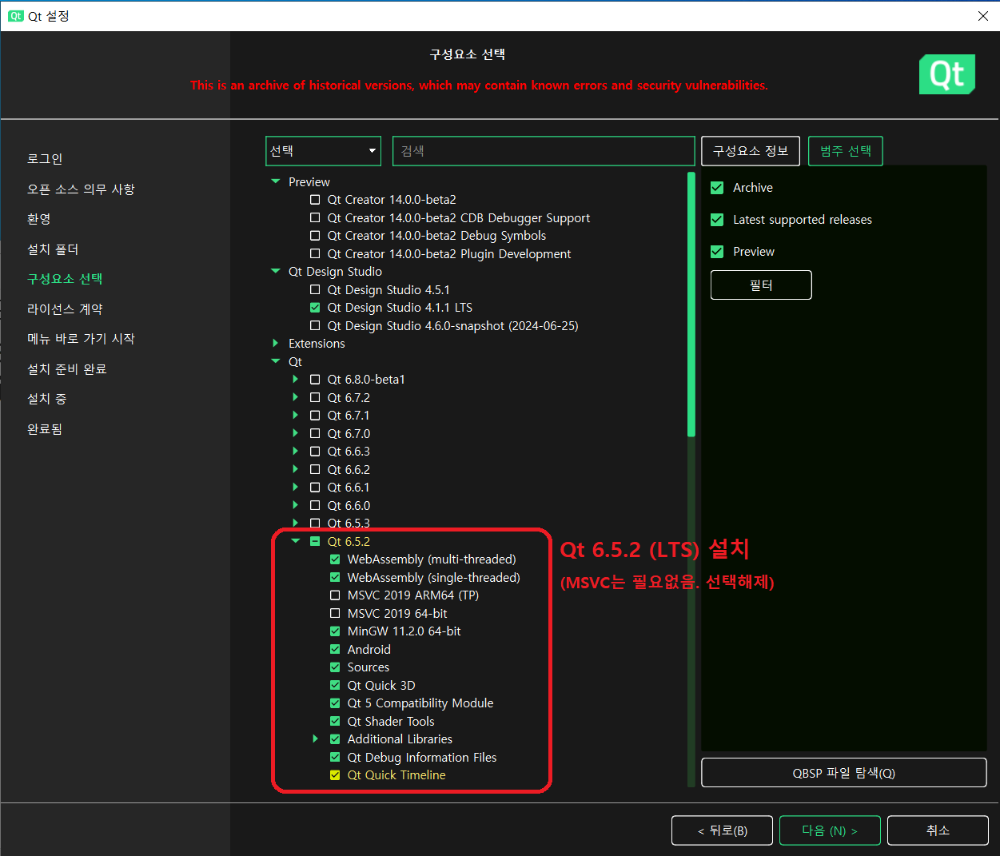
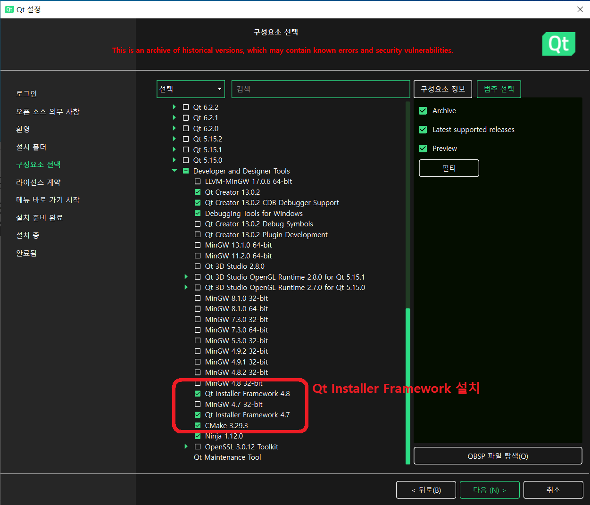

# Qt Creator 설치 방법 문서 (24년 8월 기준)

### 1. Qt Creator을 다운 받기.
* 윈도우 버전은 옆의 링크에서 [**바로 다운로드**](https://download.qt.io/official_releases/online_installers/qt-unified-windows-x64-online.exe)가 가능합니다. [[Link]](https://download.qt.io/official_releases/online_installers/qt-unified-windows-x64-online.exe)
* 윈도우 버전 이외의 Qt Creator는 옆의 링크에서 선택 가능합니다. [[Link]](https://download.qt.io/official_releases/online_installers/)

### 2. Qt Creator 계정 생성후 설치하기
* "로그인"에서 Qt 계정을 생성해서 로그인을 한 다음에 "설치 폴더" 직전까지 다음을 진행합니다.

### 3. 설치할 폴더 정하기
* 설치할 폴더를 정합니다.

### 4. 구성요소 선택하기
##### 4-1. 범주 선택하기 
* 사진과 같이 **"Archive", "Latest supported releases", "Preview"를 선택**한 다음에 필터를 누릅니다.

##### 4-2. Qt LTS 설치하기 
* 24년 8월 기준으로 **Qt LTS 버전인 6.5.2**를 사진과 같이 **선택**합니다.  
(MinGW를 사용할 것이기에 **MSVC는 선택을 해제**합니다.)

##### 4-2. Qt Installer Framework 설치하기
* 사진과 같이 Developer and Designer Tools에서 **Qt Installer Framework 4.8** 버전과 **CMake**를 **선택**합니다.  
(Qt Installer Framework 4.7은 그냥 혹시 몰라서 선택했습니다.) 

### 5. 이후 나머지 작업 하기
* 이후 무난하게 나머지 설치 과정을 진행하면 됩니다.
